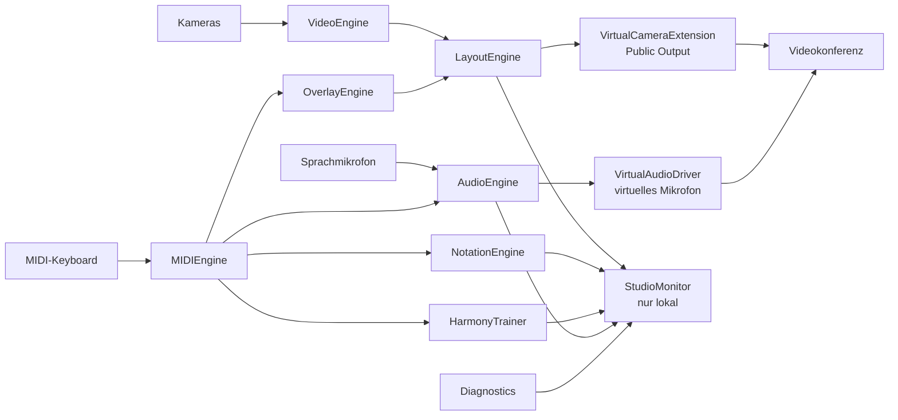
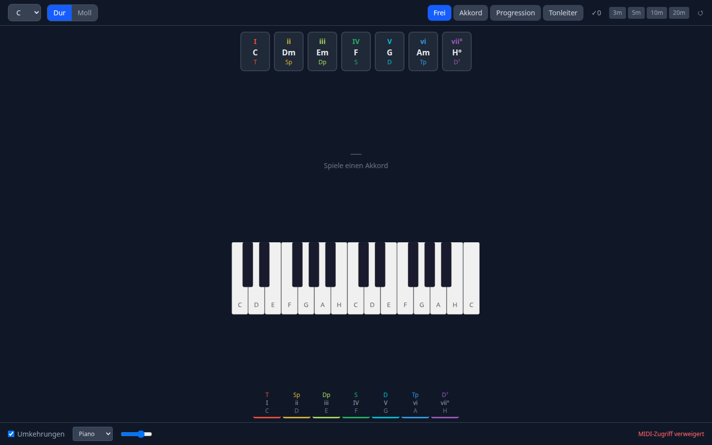

# FlowPiano

[](https://github.com/janpow77/flowpiano/actions/workflows/ci.yml)
[](LICENSE)

**macOS-Anwendung für Klavierunterricht und Klavierspiel in Videokonferenzen: Gesichts- und Tastaturkamera, MIDI-Overlay, interner Klavierklang und Sprachmikrofon werden zu einer virtuellen Kamera und einem virtuellen Mikrofon zusammengeführt.** Notation, Pegel und Diagnose sieht nur die spielende Person im lokalen Studio-Monitor.

## Auf einen Blick

- **Zwei Kameras:** Haupt- und Bild-im-Bild-Kamera (Gesicht und Tastatur) frei konfigurierbar.
- **MIDI-Keyboard-Overlay:** gespielte Tasten werden im Bild angezeigt; MIDI-Geräte werden erkannt und bei Abbruch neu verbunden.
- **Interner Klavierklang:** Wiedergabe über `AVAudioEngine`/`AVAudioUnitSampler` mit der mitgelieferten SoundFont `GeneralUser GS v1.471`, gemischt mit dem Sprachmikrofon.
- **Virtuelle Geräte:** virtuelle Kamera (Public Output) und virtuelles Mikrofon für die Konferenzsoftware.
- **Studio-Monitor:** Notation, Audiopegel und Diagnose, ausschließlich lokal.
- **Harmonielehre-Trainer:** Akkorderkennung, Stufen und Funktionen, Übungen und Kadenzen (macOS, Web und Windows).

### Kernregel: zwei Ausgaben

| Ausgabe | Für | Inhalt |
|---|---|---|
| **Public Output** (Target A) | Publikum | Gesichtskamera, Tastaturkamera, MIDI-Overlay |
| **Studio Monitor** (Target B) | spielende Person | alles aus Target A plus Notation, Pegel, Diagnose |

Kein nur lokaler Layer (Notation, Pegel, Diagnose) darf in den Public Output gelangen. Diese Trennung hat die höchste Testpriorität (siehe [Docs/TESTING.md](Docs/TESTING.md), [Tests/Unit/LayoutVisibilityTests.swift](Tests/Unit/LayoutVisibilityTests.swift)).

## Architektur (macOS)



`FlowPianoCore` koordiniert die Sitzung über alle Module; die SwiftUI-App in `Sources/App/` sitzt darauf. Modulzuständigkeiten: [Docs/ARCHITECTURE.md](Docs/ARCHITECTURE.md).

Das Repository enthält drei eigenständige Bäume:

| Verzeichnis | Inhalt | Stand |
|---|---|---|
| `Sources/`, `Tests/` | macOS-App (Swift 5.10, SwiftPM/XcodeGen, ab macOS 13), Referenzimplementierung | Laufzeitbrücken für Kamera, MIDI, Berechtigungen und Klavierklang vorhanden |
| [`web/`](web/) | Web-Variante: Harmonielehre-Trainer mit virtuellem Klavier (React, Vite, Tone.js, Web MIDI) | lauffähig im Browser |
| [`windows/`](windows/README.md) | Windows-Variante (C#, .NET 8, WPF) | Domänenlogik portiert, virtuelle Geräte als Gerüst |



## Schnellstart

### macOS-App

Voraussetzungen: Mac mit Xcode, [XcodeGen](https://github.com/yonaskolb/XcodeGen), MIDI-Keyboard und mindestens eine Kamera; für Systemerweiterungen und Signatur ein Apple-Developer-Konto (Details: [Docs/SETUP.md](Docs/SETUP.md)).

```bash
brew install xcodegen
./scripts/generate_xcodeproj.sh      # erzeugt FlowPiano.xcodeproj aus project.yml
```

Bauen und testen ohne Xcode-Projekt, wie in der CI:

```bash
swift package resolve
swift build -Xswiftc -suppress-warnings
swift test --filter FlowPianoUnitTests
swift test --filter FlowPianoIntegrationTests
swift test --filter FlowPianoUITests
```

### Web-Variante (jedes Betriebssystem)

Voraussetzung: Node.js mit npm.

```bash
cd web
npm install
npm run dev          # Vite-Entwicklungsserver
npm test             # Vitest
```

Ohne MIDI-Gerät oder ohne Web-MIDI-Unterstützung im Browser lässt sich das Klavier mit der Maus spielen.

<details>
<summary><b>Erster Start der macOS-App</b></summary>

1. Berechtigungen erteilen
2. Hauptkamera wählen
3. Bild-im-Bild-Kamera wählen, falls vorhanden
4. MIDI-Keyboard anschließen
5. internen Klavierklang testen
6. MIDI-Overlay positionieren
7. Sichtbarkeit der Notation im Studio-Monitor prüfen
8. virtuelle Geräte installieren bzw. prüfen, falls verfügbar

Häufige Probleme (zweite Kamera fehlt, kein MIDI-Eingang, virtuelle Kamera unsichtbar, kein Ton in der Konferenz): [Docs/TROUBLESHOOTING.md](Docs/TROUBLESHOOTING.md).

</details>

<details>
<summary><b>Aktueller Stand der macOS-Implementierung</b></summary>

- Mitgelieferte Klangbank `GeneralUser GS v1.471.sf2` unter `Sources/AudioEngine/Resources/` (Lizenz: [GeneralUserGS-LICENSE.txt](Sources/AudioEngine/Resources/GeneralUserGS-LICENSE.txt)).
- macOS-Laufzeitbrücken für Kameraerkennung, MIDI-Erkennung und Noteneingang, Berechtigungsstatus sowie interne Klavierwiedergabe über `AVAudioEngine` und `AVAudioUnitSampler`.
- Öffentliche Szene und virtuelles Mikrofon werden derzeit als JSON-Artefakte veröffentlicht (`public-output-scene.json`, `virtual-microphone-feed.json`).
- XcodeGen-Projektbeschreibung in `project.yml`; Bundle-IDs `com.example.FlowPiano.*` sind vor einer Veröffentlichung anzupassen.

Für eine kommerzielle Veröffentlichung ist die Lizenz der mitgelieferten Klangbank sorgfältig zu prüfen oder die App auf die macOS-Systemklangbank umzustellen.

</details>

<details>
<summary><b>Web-Variante: alle npm-Skripte</b></summary>

| Befehl | Wirkung |
|---|---|
| `npm run dev` | Vite-Entwicklungsserver |
| `npm run build` | `tsc -b && vite build` |
| `npm run preview` | gebautes Bundle ansehen |
| `npm run lint` | ESLint |
| `npm test` | Vitest (einmalig) |
| `npm run test:watch` | Vitest im Watch-Modus |

</details>

<details>
<summary><b>Windows-Variante</b></summary>

Nur unter Windows, mit .NET 8 SDK (Visual Studio 2022 oder neuer):

```powershell
cd windows
dotnet restore FlowPiano.Windows.sln
dotnet build  FlowPiano.Windows.sln --configuration Release --no-restore
dotnet test   FlowPiano.Windows.sln --configuration Release --no-build
```

Umfang, Skripte und Grenzen: [windows/README.md](windows/README.md), Portierung: [windows/docs/PORTING.md](windows/docs/PORTING.md).

</details>

<details>
<summary><b>CI</b></summary>

Der Workflow [`.github/workflows/ci.yml`](.github/workflows/ci.yml) läuft nur manuell (`workflow_dispatch`, optional mit Windows-Tests) oder bei `v*`-Tags, nicht bei jedem Push. Er baut und testet die Swift-Pakete auf `macos-14` und die Windows-Lösung auf `windows-latest`.

</details>

## Dokumentation

| Datei | Inhalt |
|---|---|
| [Docs/SPEC.md](Docs/SPEC.md) | Produktspezifikation |
| [Docs/ARCHITECTURE.md](Docs/ARCHITECTURE.md) | Laufzeitbereiche und Modulzuständigkeiten |
| [Docs/SETUP.md](Docs/SETUP.md) | Entwicklungsvoraussetzungen und Ersteinrichtung |
| [Docs/TESTING.md](Docs/TESTING.md) | Teststrategie, Trennungsregel |
| [Docs/RELEASE.md](Docs/RELEASE.md) | Freigabekriterien |
| [Docs/TROUBLESHOOTING.md](Docs/TROUBLESHOOTING.md) | häufige Probleme |
| [Docs/TARGET_MANIFEST.md](Docs/TARGET_MANIFEST.md), [Docs/XCODE_TARGET_CONCEPT.md](Docs/XCODE_TARGET_CONCEPT.md) | Xcode-Targets |
| [Docs/AGENTS.md](Docs/AGENTS.md) | verbindliche Produkt- und Arbeitsregeln für Coding-Agenten |

## Mitwirkung

Änderungen bitte als Pull Request. Vor dem Einreichen die Tests der betroffenen Variante ausführen; Änderungen an Layout oder Ausgabe müssen die Trennung von Public Output und Studio Monitor wahren ([Docs/AGENTS.md](Docs/AGENTS.md)).

## Lizenz

Der Quellcode steht unter der [MIT-Lizenz](LICENSE), Copyright (c) 2026 Jan Riener. Die mitgelieferte Klangbank GeneralUser GS steht unter eigener Lizenz ([GeneralUserGS-LICENSE.txt](Sources/AudioEngine/Resources/GeneralUserGS-LICENSE.txt)).
